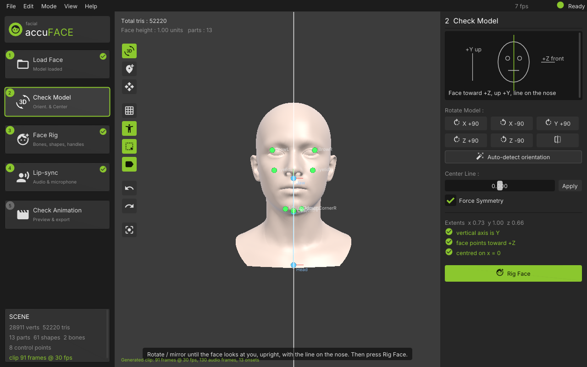
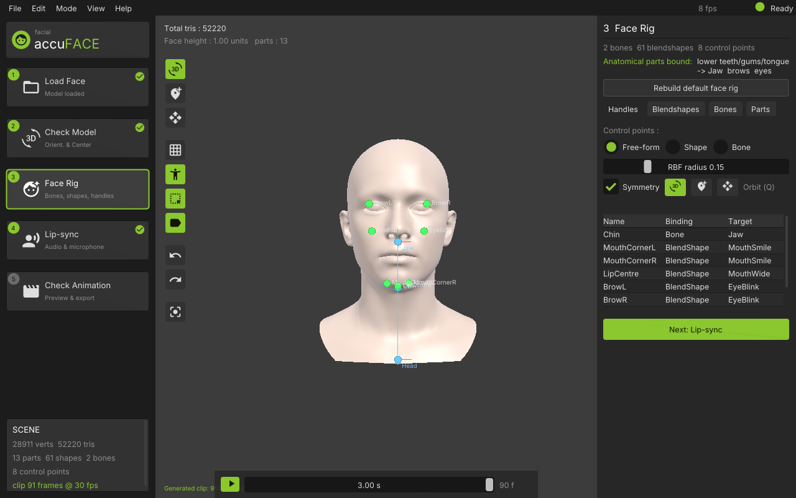
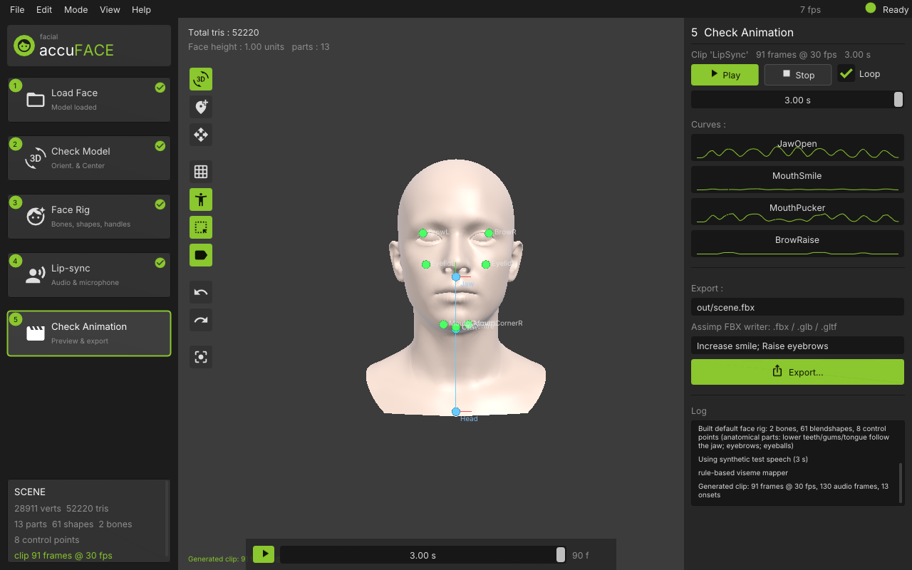

# FacialRigging

Interactive, audio-driven facial animation tool in C++17 / OpenGL 3.3 with control-point rigging,
GPU skinning + blendshapes, rule-based **and trained** lip-sync viseme mapping, live microphone
input, and glTF/FBX export. Ships with an ICT-FaceKit head (separated brows/eyes/teeth/tongue,
53 blendshapes), an AccuRIG-style step-wizard UI, a headless CLI and an Arena-agent task runner.




## Build

```bash
git clone <repo> && cd FacialRigging
tools/bootstrap.sh                      # installs cmake/ninja if missing, restores pinned submodules,
                                        # applies local patches, builds, runs the tests (≈3 min)
```

`tools/bootstrap.sh` is idempotent: re-run it after a wiped environment or a submodule bump.
`--timit` also fetches the TIMIT corpus to `data/timit` (for `fr_train_visemes`), `--torch`
fetches a CPU LibTorch into `third_party/libtorch` and enables `FR_WITH_TORCH`. Both are gitignored.
Manual equivalent:

```bash
git submodule update --init --depth 1   # + patches, see third_party/patches/README.md
cmake -S . -B build -G Ninja            # -DFR_BUILD_APP=OFF for headless-only
cmake --build build
ctest --test-dir build                  # 32 unit tests
```

Dependencies are vendored as submodules (GLFW, Dear ImGui, glm, Catch2, **Assimp**, **PortAudio**,
**alsa-lib** headers, **Material Icons**; see `third_party/patches` for two small local patches).
`python3` is needed at build time (it unpacks the Material Icons webfont and generates the icon
codepoint header from the submodule). On Linux the GUI needs X11 dev headers
(`libx11-dev libxrandr-dev libxinerama-dev libxcursor-dev libxi-dev`) for a window; without them
the app still builds (GLFW null platform) and runs **headless** (see below). PortAudio is built
against the vendored **alsa-lib** submodule headers (`cmake/FindALSA.cmake`), so the ALSA host API
is always compiled in; at run time it needs `libasound.so.2` (any Linux desktop has it) and falls
back to OSS otherwise. `fr_cli --list-devices` prints the host APIs that were compiled/found.

| CMake option | Default | Effect |
|---|---|---|
| `FR_WITH_ASSIMP` | ON | Real FBX export via Assimp (binary FBX 7.4: mesh, skin, morph targets, bone + morph-weight animation) |
| `FR_WITH_PORTAUDIO` | ON | Live microphone capture (`--live`, “Live Microphone” panel) |
| `FR_WITH_TORCH` + `TORCH_ROOT=<dir>` | OFF | `MlVisemeMapper` (LibTorch TorchScript). `TORCH_ROOT` may be a LibTorch dist or a `torch` pip package dir; the C++ ABI is matched automatically |
| `FR_WITH_FBX_SDK` + `FBX_SDK_ROOT` | OFF | Autodesk FBX SDK writer (takes precedence over Assimp) |

Export selection: FBX SDK → Assimp → glTF (`.glb` fallback only when neither FBX writer is built).

## Run

```bash
build/facial_rigging                                   # procedural head, empty audio
build/facial_rigging --model assets/sample_head.obj --audio assets/sample_speech.wav --generate
build/facial_rigging --model assets/models/nefertiti.obj --generate     # real scanned head (see assets/models/README.md)
build/fr_cli --output out/scene --format fbx --variations 2       # headless CLI, real FBX
build/fr_cli --model assets/models/igea.obj --mapper ml --output out/igea --format fbx   # LibTorch mapper (FR_WITH_TORCH)
build/facial_rigging --model assets/models/ict_face/ict_face.obj --generate   # ICT-FaceKit head, 53 authored shapes
build/fr_cli --list-devices                                        # PortAudio inputs (+ built-in test-signal device -2)
build/fr_cli --live-test -2 2                                      # live pipeline on the synthetic mic for 2 s
build/fr_train_visemes --data /tmp/timit --out assets/models/viseme_mlp.frvm  # retrain the viseme MLP
python3 tools/run_arena_task.py tools/arena_task.yaml            # agent task
```

### Headless / software GL (no display, no GPU)

```bash
tools/run_headless.sh                                   # SwiftShader (bundled, x86_64 Linux) -> out/frame_XX.ppm
tools/run_headless.sh --model assets/models/igea.obj --render-frames 8 --frame-pattern out/igea_%02d.ppm
FR_GL_LIB_DIR=/usr/lib/x86_64-linux-gnu tools/run_headless.sh     # Mesa llvmpipe instead (libegl-mesa0 + libgles2)
python3 tools/ppm2png.py out/*.ppm
```

`--headless` starts GLFW's null platform with an EGL pbuffer and an OpenGL ES 3.0 context; the
renderer and Dear ImGui run unchanged (shaders are written for GL 3.3 core *and* ES 3.0).
`--render-frames N` steps through the generated clip and dumps N frames, which is how the
screenshots in `docs/images/` were produced inside a CPU-only container.

### UI (AccuRIG-style workflow)

The shell follows Reallusion AccuRIG's layout: dark chrome, lime accent, Inter font
(`assets/fonts`), **Material Icons** (Google, Apache-2.0, `third_party/material-icons`; merged
into every ImGui font so `ICON_MD_*` strings render inline), a **left step column**, the viewport
with a vertical tool strip, and a **right property page** for the active step. Steps:

| # | Step | What it does |
|---|---|---|
| 1 | **Load Face** | OBJ path or bundled heads (ICT-FaceKit, scans, procedural); `<model>.fbs` blendshapes are picked up automatically |
| 2 | **Check Model** | Orientation fix *before* rigging: rotate ±90°/180° about X/Y/Z, mirror, auto-detect Z-up, centre-line slider (viewport shows the line), ✓/⚠ checks for "Y up / +Z front / centred", **Force Symmetry** (dragging BrowL also moves BrowR mirrored). **Rig Face** button proceeds |
| 3 | **Face Rig** | Tabs: Handles (control points: add/move/bind), Blendshapes (canonical + authored), Bones, Parts (which part follows the Jaw) |
| 4 | **Lip-sync** | Audio file or Microphone tab, rule-based vs trained-MLP mapper, generator settings, **Generate Animation** |
| 5 | **Check Animation** | Transport, curves, export path/variations, **Export…** modal (FBX / glb / glTF / pose) and log |

Keys: **Q** orbit, **W** add control point, **E** move point, **Space** play/pause, **Ctrl+Z/Y**
undo/redo. `--step N` opens a given step, `--ui-scale F` scales the UI.

| Face Rig | Check Animation |
|---|---|
|  |  |

### Test model: ICT-FaceKit head

`assets/models/ict_face/` is the ICT-FaceKit generic neutral (MIT-style licence, see
`LICENSE-ICT-FaceKit.txt`) exported by `tools/prepare_ict_facekit.py` as an OBJ with **13 `g`
groups** (Face, EyebrowL/R, EyeL/R, Eyelashes, EyeShadow, TeethUpper/Lower, GumsUpper/Lower,
Tongue, BackHead) plus `ict_face.fbs`, a compact sparse container with all **53 expression
blendshapes**. The rig binds lower teeth/gums/tongue rigidly to the Jaw bone, upper teeth/eyes/brows
to the head, and merges the ARKit-style shapes (`jawOpen`, `mouthSmile_L/R`, `browInnerUp`, …) into
the canonical shapes the generator drives; every source shape is also exposed by name.

### Trained viseme mapper

`assets/models/viseme_mlp.frvm` is **trained** (not hand-set) by `fr_train_visemes` on the
**full TIMIT corpus** (official split: 3696 TRAIN / 1344 TEST utterances after dropping SA1/SA2,
462 + 168 speakers), features from the app's own `FeatureExtractor` (17-dim frame vector ×
7-frame context), MLP 119-128-128-9 with Adam, class-balanced cross-entropy. Frame accuracy on
the official TEST set **77.5 %** (majority-class baseline 34.7 %); confusion matrix in
`assets/models/viseme_mlp.train.log`. The trainer also accepts flat `<speaker>/<utt>.wav+.phn`
subsets (then it holds out 20 % of speakers). The `.frvm` format is plain C++ so the trained
model runs in every build; `FR_WITH_TORCH` additionally allows TorchScript `.pt` models.

### Transcript-driven alignment, co-articulation, idle motion

- **Forced alignment.** Give the pipeline the spoken text (`Pipeline::transcript`) and the phone
  sequence is produced by `src/audio/g2p.*` — the **CMU Pronouncing Dictionary** shipped in
  `assets/lexicon/cmudict.tsv` (126 k words, BSD) with letter-to-sound rules for out-of-vocabulary
  words (`lastOutOfVocabularyRate()`), bracketed ARPAbet `[HH AH L OW]` pass-through and digit
  spelling — then Viterbi-aligned to the trained mapper's posteriors (`PhonemeAligner`, duration
  priors, optional silences between words, penalised phone deletions). Benchmark it with
  `fr_eval_alignment <TIMIT>/TEST/DR1 [--gt-phones] [--temp T] [--typ S]` (built with the trainer):
  on DR1 (88 utterances) text-driven alignment reaches 65.9 % frame viseme accuracy with a
  **median boundary error of 14 ms** vs the hand labels.
- **Co-articulation.** Viseme targets are blended with Cohen–Massaro dominance functions
  (`src/anim/coarticulation.*`), so bilabials win over neighbouring vowels and lips round ahead of `UW`.
- **Idle motion.** Blinks are a Weibull renewal process (mean 3 s while speaking / 4.5 s listening,
  extra blink at pause onsets, occasional double blinks) plus breathing (`src/anim/idle_motion.*`).
- **Tongue.** ICT-style heads with a tongue part get a `Tongue` bone under `Jaw`; `L/T/D/N/TH` phones raise it.

### Rig authoring: weight painting, sculpted shapes, correctives

- **Weight painting** (`R`, or *Face Rig ▸ Weights*): Add / Subtract / Replace / Smooth brushes with
  radius (`[` `]`), strength, falloff, X-symmetry and a front-facing filter; the viewport switches to
  the bone-weight heat map of the bone being painted and the brush cursor follows the surface.
  Weights stay normalised (other influences are rescaled). **Mirror L→R / R→L** copies weights across
  `x = 0` with `EyeL↔EyeR`-style bone swapping; *Normalise / clean* drops near-zero influences.
- **Bake pose as blendshape** (*Handles* tab): sculpt with free-form RBF handles (and any sliders),
  then bake the result as a new sparse blendshape - optionally *residual only* (a corrective on top
  of the active shapes) and/or split into `_L`/`_R`. The handles are zeroed and the new shape is
  animatable and exported like the authored ones.
- **Correctives** (*Correctives* tab): pick two drivers (default `JawOpen` × `MouthPucker`), pose both
  at 1.0, fix the volume loss with handles, bake `JawOpen_MouthPucker`. From then on the corrective's
  weight is `clamp(gain · A · B)` (or `min(A, B)`) whenever the drivers move - sliders, clip playback,
  lip-sync and exports included.
- **Undo everything**: every edit (handles, weights, brush strokes, bakes, rig rebuilds, model
  transforms, clip painting, imports) pushes a labelled snapshot; *Edit* menu and toolbar show what
  Ctrl+Z / Ctrl+Y will do.

### Interchange: rigged imports, ARKit mocap, audio-in-export, project files

- **Import an already-rigged head** (`.fbx` / `.glb` / `.gltf`, via Assimp): existing morph targets
  and bones are kept and driven directly. ARKit-named targets (`jawOpen`, `mouthSmileLeft`, ...) are
  merged into the canonical channels, jaw/head/eye joints are detected by name and the skin weights
  come from the file (`src/core/scene_import.*`, marked as *painted* so project files keep them).
- **ARKit 52 mocap CSV** (`--format csv`, *Export ▸ ARKit mocap CSV*): the Live Link Face / Face Cap
  layout (`Timecode,BlendShapeCount,EyeBlinkLeft ... RightEyeRoll`) at 60 fps, readable back with
  `readArkitCsv`. 50/52 coefficients are mapped on the ICT head (`ArkitMapping`).
- **Live Link streaming**: *Check Animation ▸ Live Link* streams the current pose as Live Link Face
  UDP packets (version 6, 61 floats, head/eye rotation included) while you play, scrub, pose or talk
  into the microphone; `fr_cli --livelink host:port [speed]` replays a clip in real time. Add an
  *Apple ARKit* Live Link source in Unreal on that port.
- **Audio ships with exports**: `<out>.wav` is written next to every export with its start offset -
  glTF `asset.extras.audio {uri, offset, sampleRate, duration}` plus per-animation `extras.audio`,
  `<out>.audio.json` manifests for FBX / CSV, and `--embed-audio` packs the WAV into the `.glb` as a
  buffer view. `--no-audio-sidecar` turns it off.
- **Project files** (`.frproj`, *File ▸ Save / Open Project*, Ctrl+S, `--project`, `--save-project`):
  one JSON with the model and audio paths (relative), orientation fixes, transcript, mapper and
  lip-sync settings, every handle, painted skin weights, baked and corrective shapes, bone pose and
  the edited clip. Opening one re-runs the import, rebuilds the rig and replays the edits.

### Timeline editor

On *Check Animation* a dope-sheet opens under the viewport: a time ruler, an **Audio** waveform lane
(min/max envelope with onset ticks), **Words / Phones / Visemes** lanes (from the forced alignment
and the segments actually used for the mouth), and a curve lane. The channel picker lists every
blendshape curve and every animated **bone axis** (`Jaw / Head / EyeL / EyeR / Tongue` X/Y/Z, in
degrees). Two modes:

- **Paint** - drag to overwrite the baked frame values of a blend curve; Shift-drag selects a range;
  **Gain / Offset / Smooth / Flatten** act on the ticked curves inside it.
- **Keys** - a non-destructive **key layer** (`src/anim/key_layer.*`): double-click adds a key,
  drag keys (frame-snapped, Ctrl for free), drag the orange **tangent handles**, `K` keys the
  playhead, `Del` removes; drag on empty space **box-selects** keys (then drag them together, Ctrl+A
  selects all) and **Pose as keys** bakes the viewport pose (sliders, handles, gaze) as keys on every
  channel that differs from the clip. Tangents are Auto (overshoot-free Catmull-Rom), Flat, Linear or Free,
  optionally broken. The composite is `baked + layer` for weights and `baked * rot(layer°)` for
  bones; the grey curve shows the baked original. Regenerating the lip-sync **keeps the keys**,
  exports flatten them, clip JSON and project files round-trip them, and *Flatten to baked* merges
  them on demand. Layer weight / mute sliders let you audition the fix.

Alt-drag / drag the ruler to scrub, Ctrl+wheel to zoom; all edits are undoable (Ctrl+Z).

### Performance layer, expressions, gaze

- **Eye bones + look-at.** Models with separate `EyeL`/`EyeR` parts (ICT head) get `EyeL`/`EyeR`
  bones pivoted at the eyeball centres; only the eyeballs follow them. `Rig::lookAt(point)` /
  `Rig::setGaze(yaw, pitch)`; UI: *Face Rig ▸ Expression ▸ Gaze* ("Look at camera"); CLI `--gaze YAW PITCH`.
- **Expression presets** (`neutral happy sad angry surprised disgusted`) over 11 canonical shapes
  (new: `MouthFrown`, `BrowDown`, `EyeWide`, procedural fallbacks + ARKit merges). Apply as a pose,
  layer under lip-sync (`LipSyncSettings::emotion/emotionAmount`, `--emotion angry 0.6`), or use
  as an export variation (`--variation "sad=0.5"`).
- **Head motion & saccades.** The generator adds loudness/onset-driven nods and slow sway on the
  `Head` bone and saccade-and-hold eye movement (when eye bones exist); `--head-motion`, `--gaze-motion`
  (0 disables). All bone curves are exported to FBX/glTF.
- **Clip JSON** (`--format json`, *Export ▸ Export clip JSON*, *Check Animation ▸ Clip JSON*): mesh-free
  curves with ARKit alias lists per shape (`"arkit": ["mouthSmile_L","mouthSmile_R"]`) for
  retargeting; `loadClipsJson` / `--clip-in` / *File ▸ Import clip JSON* loads it back onto any rig.
- **Anti-aliasing.** The 3D viewport renders into a multisampled FBO (default 4×, `--msaa 0|2|4|8`,
  *View ▸ Anti-aliasing*) and is resolved with `glBlitFramebuffer` before the UI is drawn, so it also
  works on GL ES / SwiftShader headless renders where multisampled default framebuffers don't exist.
- **Shading modes** (keys `1`–`5`, View menu, toolbar): Lit, Normals, **Bone-weight heat map**
  (thermometer button next to each bone), **Blendshape influence** (gradient button next to each
  shape, or all active shapes), Displacement. The heat map exposed - and fixed - jaw weights
  bleeding onto the neck of the full-bust ICT model.

## Layout

```
src/core    mesh, OBJ I/O, ray casting, camera        src/render  GL loader, shaders, renderers
src/rig     skeleton, blendshapes, control points, RBF src/ui      ImGui panels
src/audio   WAV, FFT, MFCC/pitch/onsets, visemes       src/app     pipeline, CLI, GUI app
src/anim    clips/curves, lip-sync generator           tools/      Arena task + runner
src/export  glTF/FBX/JSON/ARKit CSV, Live Link               tests/      Catch2
```

Docs: [Design](docs/DESIGN.md) · [Status vs design](docs/STATUS.md) · [Agent integration](docs/AGENT.md)
