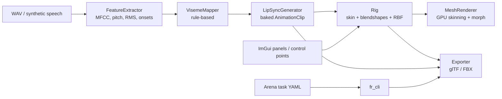

# FacialRigging – Design Document

> Original proposal for a C++/OpenGL desktop application for interactive, audio-driven
> facial animation with control-point rigging and FBX export. Section-by-section status of the
> implementation lives in [STATUS.md](STATUS.md); this file is the design reference.

## Executive Summary
We propose a C++/OpenGL desktop application for interactive facial animation, incorporating **control-point rigging**, **audio-driven motion**, **real-time performance**, and **FBX export**. Users can click to add facial control points (e.g. on eyelids, lips, brows) via an **ImGui**-based UI, rig them to the 3D mesh, and deform the mesh using a mix of **blendshape (morph target)** and **skeletal skinning** methods. An **audio analysis** pipeline (MFCC, pitch, energy, onset detection) drives the animation: phoneme-to-viseme mapping and (later) ML models translate speech to facial motion. The system supports real-time playback (GPU skinning) or offline baking (keyframe interpolation). The animated result can be **exported as FBX** using the Autodesk FBX SDK (animation stacks, curves for bones/blendshapes), with **glTF 2.0** as an always-available open fallback. An **Arena AI agentic-mode task** template lets an agent automate running the app, exporting, and producing variations.

## Features and Requirements
- **3D Face Model and Control Points:** Load a neutral 3D face mesh (OBJ). Users place and adjust *facial control points* on the mesh surface; each is “rigged” to deform the mesh.
- **Rigging Modes:** **Blendshape/morph target** deformation and **bone-based skinning** (Head + Jaw skeleton with weights) plus **free-form RBF handles**.
- **Mesh Deformation:** `v_final = skin(v) + Σ w_i·Δv_i (+ RBF field)`. Topology consistency for blendshapes; correct bind poses for bones.
- **Audio-Driven Animation:** WAV import; MFCCs, pitch (YIN), RMS energy, spectral centroid, spectral-flux onsets; rule-based viseme mapping with co-articulation smoothing; ML mappers plug into the same interface.
- **Synchronization/Timing:** Baked at a fixed frame-rate aligned to the audio timeline; interpolation between keys.
- **Real-Time Rendering:** OpenGL 3.3 core; skinning + blendshapes evaluated in the vertex shader (bone matrices as uniforms, deltas in a texture buffer). CPU path for RBF handles.
- **Export Pipeline:** FBX via Autodesk FBX SDK (`FbxSkin`, `FbxBlendShape`, `FbxAnimStack` with keyed curves) and glTF 2.0 (skin, morph targets, `weights`/`rotation` animation channels).
- **Arena AI Agentic Prompt:** YAML task + runner script that maps steps onto the headless CLI.
- **Cross-Platform Build:** CMake, vendored GLFW/ImGui/glm/Catch2 submodules, C++17.
- **Testing:** Catch2 unit tests for audio features, rigging math, raycasting, animation baking and export.
- **Security/Privacy:** Voice recordings can be biometric personal data – keep audio in memory, avoid persisting it, encrypt at rest if kept.

## UI/UX: Control Point Placement and Rigging
- **3D Cursor:** Click in the viewport → unproject to a ray → Möller–Trumbore against the bind mesh → add a handle at the hit.
- **Gizmos:** Handles drawn as round points; drag in a camera-facing plane. Axis tripod on the selection; RBF radius circle; blendshape drive axis line.
- **Rig-Point Association:** A point binds to a **bone** (drives its translation), a **blendshape** (offset projected on a drive axis → weight) or **free-form** (RBF warp of nearby vertices).
- **Workflow Panels:** Toolbar (Orbit / Add Point / Move Point, Undo/Redo), Control Points table + inspector, Rig (blendshape sliders, bone pose), Audio & Animation (load, waveform, lip-sync settings, playback/scrub, curve plots), Export (path, variations, log).

## Mesh Deformation Methods

| Method | Description | Pros | Cons |
|---|---|---|---|
| **Bone/Skinning** | Skeleton + per-vertex weights, linear blend skinning | Efficient on GPU; compact; broad motion | Less fine detail; weight painting needed |
| **Blend Shapes** | base + Σ(weight·delta) | High-fidelity expressions; combinable | Memory/compute scale with shapes×verts |
| **Delta Morphs (Correctives)** | Small corrective targets | Fix artefacts from skin/blend combos | More authoring |
| **Free-Form (RBF)** | Handle displacements interpolated by radial basis functions | Few handles deform many vertices smoothly | CPU evaluation; less predictable |
| **Physically-Based** | Muscle/tissue simulation | Very realistic | Too expensive for real-time |
| **Hybrid (Bones+Blendshapes)** | Skeleton for gross motion + shapes for detail | Industry standard | Most complex setup |

**Interpolation:** slerp for bone rotations, linear for weights. Baking samples at a fixed frame rate; optional box-filter smoothing of curves.

## Data Structures and Algorithms
- **Control Points:** rest position, offset, nearest vertex, binding type, target (bone/shape), drive axis/range, RBF radius.
- **Vertex Skinning:** up to 4 `(bone, weight)` per vertex; `skinning = poseWorld · inverse(bindWorld)`.
- **Blend Shapes:** sparse `(index, delta)` lists; densified for GPU upload and export.
- **RBF Deformer:** Wendland C2 compact-support kernel; Gaussian-elimination solve for handle weights; field evaluated on bind positions.
- **Audio Features:** Hann-windowed 1024-sample frames, hop 512; radix-2 FFT; 26 mel bands → 13 MFCCs (DCT-II); YIN pitch; spectral centroid; spectral flux with median-relative peak picking for onsets.
- **Viseme Mapping:** 9-class set (Silence, AA, EE, IH, OH, UW, MBP, FV, L_TH) from loudness/voicing/brightness/openness heuristics plus an ARPAbet phoneme→viseme dictionary.

## Real-Time vs Offline Processing
- **Real-Time:** GPU skinning/morphing per frame; CPU fallback only when RBF handles are active.
- **Offline:** Whole-clip feature extraction and baking to keyframes for export.
- **Hybrid:** Interactive edits in real time; final pass bakes to a fixed frame grid.

## Audio Analysis, Viseme Mapping, ML
The current implementation is a dependency-free C++ pipeline (`src/audio`). Essentia/PortAudio/libsndfile remain recommended when live capture, MP3/FLAC or richer descriptors are needed. ML mappers (RNN/LSTM/Transformer via LibTorch/TensorFlow C++) should implement `VisemeMapper::map()` or directly emit an `AnimationClip`.

| Strategy | Pros | Cons |
|---|---|---|
| Rule-based (dictionary/heuristics) | Simple, deterministic, no data | Ignores co-articulation nuance |
| HMM/Statistical | Handles timing | Needs training data |
| Neural (MFCC→weights) | Learns co-articulation | Data-hungry |
| End-to-end deep | Most realistic | High complexity |

## Synchronization, Interpolation, Keyframe Baking
Frame grid `t = i / fps` up to the audio duration; nearest feature/viseme frame per key; all blendshapes get a curve (flat zero if unused) so exporters always see the full set; Jaw bone gets a rotation curve derived from JawOpen.

## Performance Optimisation
Bone matrices as uniform array (≤32), blendshape deltas as `samplerBuffer` fetched by `gl_VertexID`, weights uniform array; CPU path uploads positions/normals only when needed. Future: compute-shader path, LOD, SSBOs.

## FBX Export Pipeline
`FbxManager`/`FbxScene` → mesh (control points, normals, UVs, polygons) → skeleton nodes + `FbxSkin` clusters with `TransformLinkMatrix` + bind pose → `FbxBlendShape` with a channel/`FbxShape` per target → per-clip `FbxAnimStack`/`FbxAnimLayer`, keys on `DeformPercent` (×100) and `LclRotation`/`LclTranslation` → `FbxExporter::Export`.

## Cross-Platform Build Considerations
CMake ≥3.20; GLFW/ImGui/glm/Catch2 as git submodules; X11/Wayland backends auto-disabled when headers are missing; FBX SDK optional via `FR_WITH_FBX_SDK`/`FBX_SDK_ROOT`.

## Arena AI Agentic-Mode Integration
See [AGENT.md](AGENT.md) and `tools/arena_task.yaml`.

## Recommended Libraries and Tools
GLFW (window/context), Dear ImGui (UI), glm (math), Catch2 (tests); optional: Autodesk FBX SDK, Assimp, PortAudio, libsndfile, Essentia, LibTorch/TensorFlow C++, Eigen, OpenCV.

| Library | Category | Pros | Cons |
|---|---|---|---|
| GLAD vs built-in loader | GL loader | GLAD: full API | We ship a 50-function loader to avoid generated code |
| GLFW vs SDL2 | Window | Lightweight | SDL2 heavier |
| ImGui vs Qt | GUI | Immediate mode, tiny | Not native widgets |
| glTF (built-in) vs FBX SDK | Export | Open, always available | FBX needs proprietary SDK |
| PortAudio / libsndfile | Audio I/O | Cross-platform | Extra deps (WAV reader built-in instead) |
| Essentia vs built-in DSP | Features | Rich | Heavy; built-in covers MFCC/pitch/onset |
| glm vs Eigen | Math | GLSL-like | No solvers (small RBF solve hand-written) |
| LibTorch vs TensorFlow C++ | ML | Flexible | Large binaries |

## Code Architecture
```
src/core    mesh, OBJ I/O, raycasting, orbit camera
src/rig     skeleton, skin weights, blendshapes, control points, RBF deformer, default face rig
src/audio   WAV I/O, FFT, feature extraction (MFCC/pitch/energy/onset), viseme mapper
src/anim    animation clip/curves, lip-sync generator
src/export  Exporter interface, glTF 2.0 writer, FBX SDK writer (+ stub)
src/app     Pipeline (headless orchestration), CLI, GUI application
src/render  GL loader, shaders, mesh renderer (GPU skin+morph), gizmo renderer
src/ui      ImGui panels
tools/      Arena task template + runner
tests/      Catch2 unit tests
```



## Testing and Validation
Unit tests (`tests/`): FFT peak/inverse, WAV round-trip, YIN pitch, MFCC tilt, feature dynamics, viseme normalisation, OBJ parsing, ray casting, skin normalisation, jaw rotation, blendshape linearity, RBF interpolation, curve sampling, clip baking, GLB structure, exporter fallback. Round-trip checks with `pygltflib` were used during development.

## Security and Privacy for Audio Data
Audio is processed in memory; nothing is written unless explicitly requested (`--save-audio`). Add encryption at rest and consent prompts before shipping recording features.

## Implementation Roadmap

| Milestone | Status |
|---|---|
| Project setup (CMake, GLFW, ImGui) | done |
| Model loading (OBJ + procedural) | done |
| Control-point UI + 3D picking | done |
| Rig data structures | done |
| Mesh deformation (GPU skin + blendshapes, CPU RBF) | done |
| Audio I/O + features | done (WAV; no live capture yet) |
| Viseme/animation mapping | rule-based done; ML pending |
| Playback & UI refinement | done (play/pause/scrub/plots) |
| FBX export | SDK path written (needs SDK to compile); glTF fallback done |
| Multi-platform build | Linux verified; Windows/macOS untested |
| Performance tuning | basic GPU path; compute shaders/LOD pending |
| Arena AI integration | done (task YAML + runner) |
| Testing & docs | 21 tests; docs in `docs/` |
