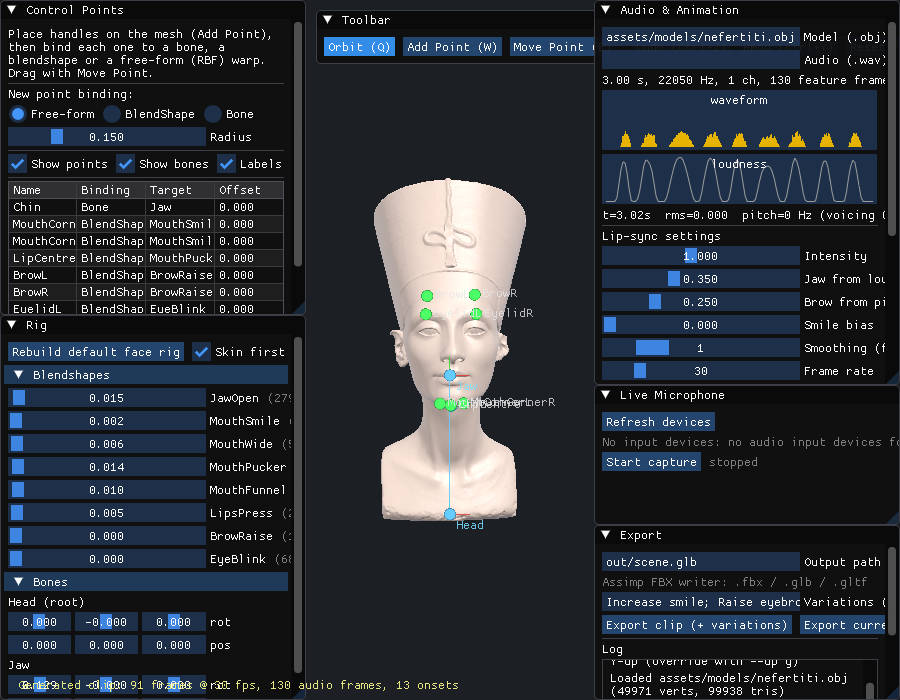
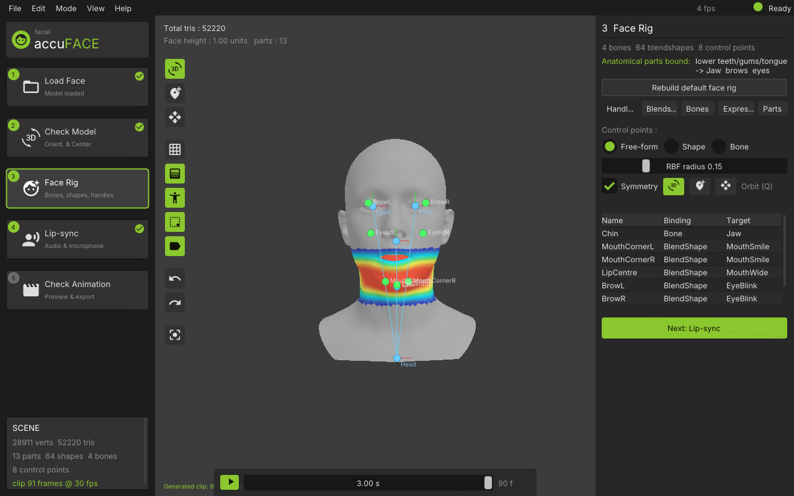
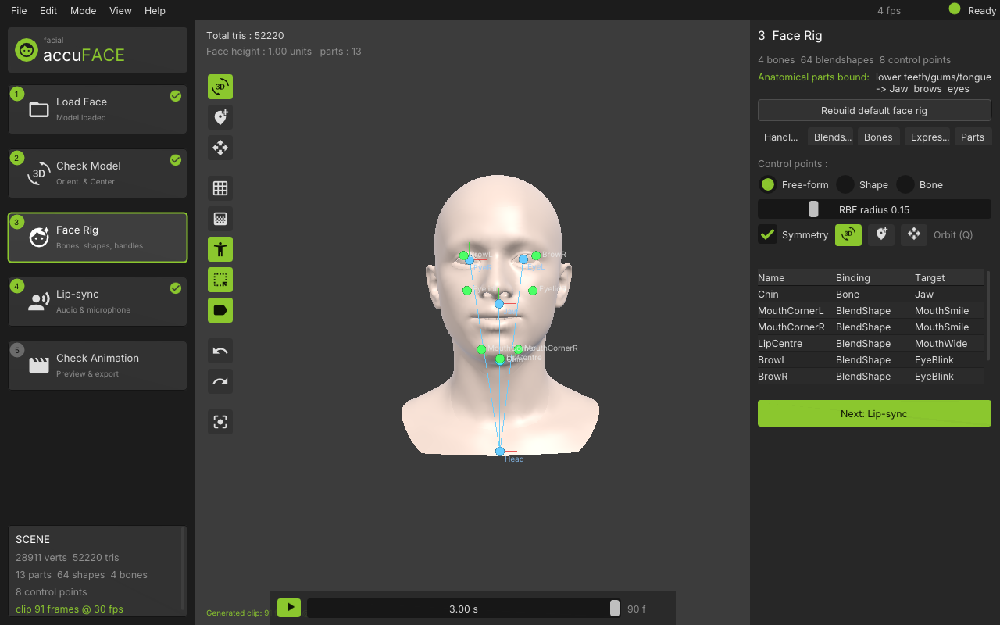

# Implementation status vs. design

| Design area | Implemented | Notes / next steps |
|---|---|---|
| Control-point placement (ray picking, gizmos) | ✅ `src/core/raycast.*`, `src/app/application.cpp` | Drag in camera plane; axis-constrained drag could be added |
| Bindings: bone / blendshape / free-form | ✅ `src/rig/rig.*`, `rbf_deformer.*` | Weight painting UI not yet built (weights are procedural) |
| Skinning + blendshapes | ✅ CPU and GPU (vertex shader, RGB32F delta texture) | Runs on GL 3.3 core **and** GL ES 3.0; compute-shader path pending |
| Default face rig | ✅ Head/Jaw bones, 8 canonical shapes; **authored shapes** via `.fbs` (53 ICT/ARKit) merged into canonical names; **mesh parts** (OBJ groups) drive rigid binding of teeth/gums/tongue/eyes/brows | Weight painting UI still procedural |
| WAV import | ✅ PCM 8/16/24/32 + float | MP3/FLAC via libsndfile/dr_libs later |
| Features: MFCC, pitch, RMS, onsets, centroid | ✅ `src/audio/features.*` | Essentia optional |
| Viseme mapping | ✅ rule-based + phoneme dictionary + `MlVisemeMapper` with **trained weights** `assets/models/viseme_mlp.frvm` (full TIMIT, official TEST split, `fr_train_visemes`: 77.5 % frame acc vs 34.7 % baseline) | `.frvm` runs without LibTorch; TorchScript `.pt` needs `-DFR_WITH_TORCH=ON` |
| Baked clips, playback, scrub | ✅ `src/anim/*`, GUI panel | Speaker playback of the clip not wired; visual-only preview |
| glTF 2.0 export | ✅ GLB / glTF+bin with skin, morph targets, animations | Verified with pygltflib |
| FBX export | ✅ Assimp 5.4.3 writer (default, `src/export/assimp_fbx_exporter.cpp`), FBX SDK still optional | Binary FBX 7.4 with mesh, skin, 8 morph targets, jaw rotation + morph-weight curves; verified by Assimp re-import in tests (see `third_party/patches`) |
| Variations | ✅ `parseVariation` | |
| Arena agent integration | ✅ `tools/arena_task.yaml`, `tools/run_arena_task.py` | |
| Tests | ✅ 55 Catch2 cases (48 with LibTorch) | FBX round-trip, trained mapper sanity, live pipeline on the test-signal device, OBJ parts / FRBS round-trip, ICT rig binding |
| Cross-platform | Linux verified, incl. **headless rendering** via `--headless` (GLFW null platform + EGL pbuffer, SwiftShader/Mesa) | Windows/macOS untested |
| Live microphone input | ✅ `src/audio/live_capture.*` (PortAudio, static submodule) + “Live Microphone” panel / `--live` | ALSA host API compiled in from the `alsa-lib` submodule headers; built-in **test-signal device (-2)** exercises the whole live path without hardware (`fr_cli --live-test -2 2`, unit test). Sandbox has no `libasound.so.2`/devices → real hardware needed to hear audio |
| ML lip-sync | ✅ `MlVisemeMapper` behind `VisemeMapper` (`--mapper ml [--model-pt x.pt]`) | LibTorch is not a submodule (binary dist): point `TORCH_ROOT` at a LibTorch or `torch` wheel dir |
| UI | ✅ AccuRIG-style shell (`src/ui/theme.*`, `panels.cpp`): Inter font, **Material Icons** (submodule, unpacked from WOFF at build time), dark/lime theme, left 5-step wizard incl. **Check Model orientation step** with working **Force Symmetry**, right property page, export modal | |
| Test model with separated parts | ✅ `assets/models/ict_face` (ICT-FaceKit: 13 parts, 53 shapes); jaw weights re-derived from the condyle pivot with a neck cut-off | `tools/prepare_ict_facekit.py` regenerates from the upstream repo |
| Eye bones / gaze | ✅ `EyeL`/`EyeR` bones from eyeball parts, `Rig::lookAt`/`setGaze`, UI gaze tab, saccades in the generator | needs separated eyeballs (ICT head); single-surface scans skip it |
| Expressions / emotions | ✅ 6 presets over 11 canonical shapes (3 new procedural + ARKit-merged), pose / lip-sync layer / export variation | |
| Head motion | ✅ loudness/onset-driven nods + noise sway on `Head`, exported as bone curves | |
| Clip interchange | ✅ mesh-free clip JSON with ARKit aliases, import/export in UI + CLI (`--format json`, `--clip-in`) | |
| Anti-aliasing | ✅ offscreen MSAA FBO + resolve blit (desktop GL and GL ES 3.0), runtime-switchable | |
| Diagnostic shading | ✅ normals / bone-weight heat map / blendshape influence / displacement (keys 1-5) | |
| Co-articulation | ✅ Cohen–Massaro dominance blending in `src/anim/coarticulation.*` (per-viseme dominance/plateau, tongue-up hint from the phone) | |
| Transcript forced alignment | ✅ `src/audio/g2p.*` (**CMUdict 126 k words** in `assets/lexicon` + rules for OOV) → `PhonemeAligner` Viterbi over the mapper posteriors with duration priors, optional inter-word silence and penalised phone deletion; `Pipeline::transcript`; benchmark `fr_eval_alignment` on TIMIT TEST/DR1: **65.9 %** frame viseme accuracy from text (classifier alone 66.1 %; 73.3 % with the true phone sequence), viseme boundary error **median 14 ms**, p90 56 ms | CLI + GUI `--transcript` (Lip-sync page text box shows words/phones/coverage) |
| Stochastic idle motion | ✅ `src/anim/idle_motion.*`: Weibull-renewal blinks (faster while speaking, extra draw at pause onsets, double blinks), breathing with inhale cue | |
| Tongue | ✅ `Tongue` bone (child of Jaw) from the tongue part; `Rig::setTongue(up,out)` driven by the phone class | |
| Timeline editor | ✅ viewport dope-sheet (`panels.cpp` `timeline::`): ruler, word/phone/viseme lanes, paintable curves, range selection with gain/offset/smooth/flatten, zoom/scroll, undo of clip edits | Bone-curve editing and key-level (non-baked) editing not yet |
| Weight painting | ✅ `src/rig/rig_tools.*` brush (Add/Subtract/Replace/Smooth, falloff, symmetric, front-facing-only) in the viewport with heat-map feedback (tool `R`, `[ ]` radius); **Mirror weights L↔R** with L/R bone swap; normalise/clean | |
| Blendshape sculpt from handles | ✅ *Handles ▸ Bake pose as blendshape*: free-form (RBF) sculpt + active shapes → new sparse shape (residual-only option, L/R split) | |
| Corrective / combination shapes | ✅ `Rig::combinations` (`w = clamp(gain·A·B)` or min), evaluated on `setBlendWeights`/clip playback; *Correctives* tab bakes `A_B` from the posed fix; exported like any shape | Correctives are baked into exports as static shapes; driver logic itself is not exported (FBX/glTF have no expression graph) |
| Undo for everything | ✅ labelled snapshots of skeleton, skin, shapes, handles, correctives, clip (and mesh on transforms); 64 steps / 256 MB budget; menu + toolbar show the label | |
| Import existing rigs | ✅ `src/core/scene_import.*` (Assimp): morph targets + skeleton + weights from FBX/glTF, ARKit names merged, jaw/head/eye joints by name | Animations inside the file are not imported yet |
| ARKit 52 CSV + Live Link | ✅ `src/export/arkit_livelink.*`: mapping (50/52 on ICT), 60 fps mocap CSV writer/reader, Live Link Face UDP sender; GUI stream panel, `--format csv`, `--livelink` | Mapping is name-based; no calibration against a real capture yet |
| Audio in exports | ✅ `.wav` sidecar + offsets (glTF `asset.extras.audio`, `.audio.json` manifests), `--embed-audio` buffer view in `.glb` | FBX has no audio container; manifest only |
| Project files | ✅ `.frproj` (`src/app/project.*`): paths, orientation, settings, handles, painted skin, user/corrective shapes, pose, clip; GUI + CLI | Undo history is not persisted |
| Audio encryption at rest | ❌ | Only needed once recordings are persisted |

## Running here (sandbox, no GPU / no X11)

```
cmake -S . -B build -G Ninja && cmake --build build
tools/run_headless.sh                                  # SwiftShader GL ES 3.0 -> out/frame_XX.ppm
python3 tools/ppm2png.py out/frame_*.ppm
```






Known gaps: blendshape weights animate in FBX only through the Assimp patch (validated with
Assimp's own importer, not yet in Maya/Blender); the live mic path is untested with a real
device.
